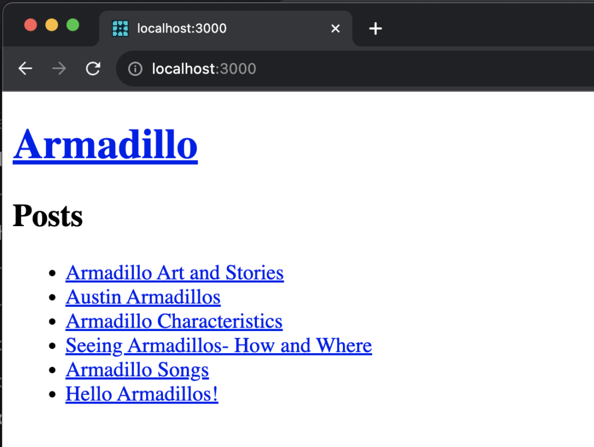
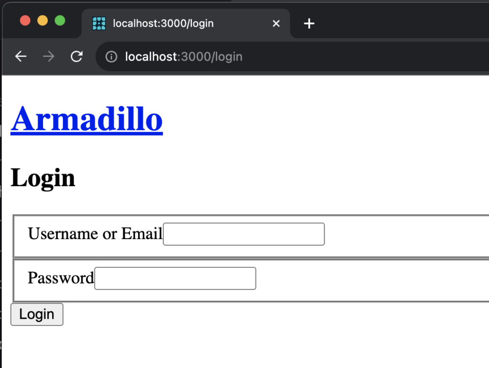
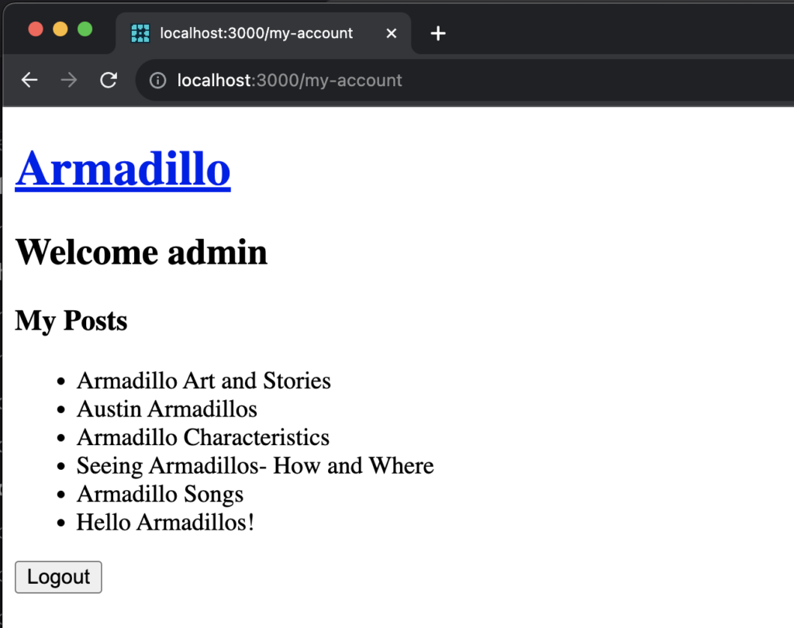
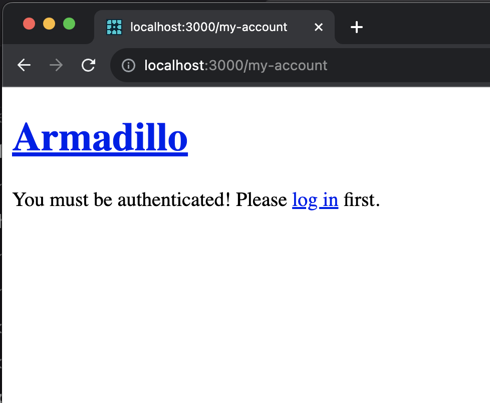

# Getting Started with the Experimental App Router

This tutorial will introduce you to Faust’s experimental app router example project. It contains a site demonstrating the use of utilities like [getClient](./getclient.md), [getAuthClient](./getauthclient.md), [faustRouteHandler](./faustroutehandler.md), [loginAction](./onlogin-server-action.md), and [logoutAction](./onlogout-server-action.md). You can use this project as a base for future projects and as a good reference site for app routing. It assumes you are comfortable with the command line, have a foundational knowledge of Faust and Next.js routing, and understand the basics of JavaScript, WordPress and Bash.

- [Experimental App Router example project](https://github.com/wpengine/faustjs/tree/canary/examples/next/app-router)

- [NPM package](https://www.npmjs.com/package/@faustwp/experimental-app-router)

## How to Get the Example Working Locally

### Install and Build

Get started by downloading the example project by running:

```shell
npx create-next-app \
    -e https://github.com/wpengine/faustjs/tree/main \
    --example-path examples/next/app-router \
    --use-npm
```

### .env.local File Set Up

Copy the example’s `.env.local.sample` file, ensuring you rename the file `.env.local`.

You’ll see an example `NEXT_PUBLIC_WORDPRESS_URL` in this file. Set this to your WordPress site’s URL.

You’ll also see a NEXT\_PUBLIC\_URL set to http://localhost:3000. You can keep that as is for now.

Set your FAUST\_SECRET\_KEY. For more information on where to find this secret key, refer back to this example.


### Run the Project

Run the example project by entering `npm run dev`
Navigate to `http://localhost:3000/.`

You should now see a simple site page using your site’s name and a few published posts:



## The Example Project File Structure

This is the new standard file structure for App Router Next.js apps. For more information, check out the [App Router](https://nextjs.org/docs/app) docs from Next.js.

```shell
❯ tree -L 2
.
│ν app
│   └──  [postSlug]
│            └──  page.tsx
│   └──  api/faust/[route]
│            └──  route.ts
│   └──  my-account
│            └──  page.tsx
│   └──  making-client-queries
│            └──  page.tsx
│   └──  login
│            └──  page.tsx
│   ├──  layout.tsx
│   └──  page.tsx
│❯ node_modules
│.env.local.sample
│faust.config.js
│next-end.d.ts
│next.config.ts
│package.json
│possibleTypes.json
│tsconfig.json
```

## Fetching Data

[getClient](./getclient.md) is a function that returns an ApolloClient, specifically for use in React Server Components (RSC). When making authenticated requests in the Next.js App Router from an RSC, the [getAuthClient](./getauthclient.md) is used instead. Both are part of the `@faustwp/experimental-app-router` package.

In the example project under the folder `my-account`, you’ll find an example of getAuthClient in action:

```js
// in examples/next/app-router/app/my-account/page.tsx
import { gql } from '@apollo/client';
import { getAuthClient } from '@faustwp/experimental-app-router';

export default async function Page() {
  const client = await getAuthClient();

  if (!client) {
    return <>You must be authenticated</>;
  }

  const { data } = await client.query({
    query: gql`
      query GetViewer {
        viewer {
          name
          posts {
            nodes {
              id
              title
            }
          }
        }
      }
    `,
  });

  return (
    <>
      <h2>Welcome {data.viewer.name}</h2>

      <ul>
        {data.viewer.posts.nodes.map((post) => (
          <li key={post.id}>{post.title}</li>
        ))}
      </ul>
    </>
  );
}
```

### Fetching Data on the Client

Additionally, you can make client side requests using Apollo's `useQuery` hook like usual (You will need to do this in a client component using the `use client` directive):

```js
'use client';

import { gql, useQuery } from '@apollo/client';

export default function Page() {
  const { data } = useQuery(gql`
    query MyQuery {
      generalSettings {
        title
      }
    }
  `);

  return <>{data?.generalSettings?.title}</>;
}
```

For client side queries to work, make sure you are wrapping your root `layout` with the `<FaustProvider>` component imported via:

```js
import { FaustProvider } from '@faustwp/experimental-app-router/ssr';
```

## Authentication

Authentication in the experimental-app-router is powered by two utilities, [onLogin](./onlogin-server-action.md) and [onLogout](./onlogout-server-action.md). These are built on [Next.js server actions](http://nextjs.org/docs/app/api-reference/functions/server-actions\) and perform an action to log a user in and out using cookie caching and cookie removal, respectively.

In the example project, navigate to `http://localhost:3000/login` and log into your app using your `wp-admin` credentials from the `NEXT_PUBLIC_WORDPRESS_URL` you set in your .env.local file.



Upon successfully logging in, you’ll be directed to `http://localhost:3000/my-account`. This functionality comes from the helper function, [onLogin](./onlogin-server-action.md).



The `/my-account` page grabs the authenticated user's name and posts and displays them.

This page also has a "Logout" button, clicking it calls the [onLogout](./onlogout-server-action.md) server action, the user is logged out, and the page is refreshed with no authenticated user.

Note that when viewing the `/my-account` without an authenticated user, the first conditional statement in the associated `my-account/page.tsx` will be triggered, and the message, `You must be authenticated` will show on the screen.


